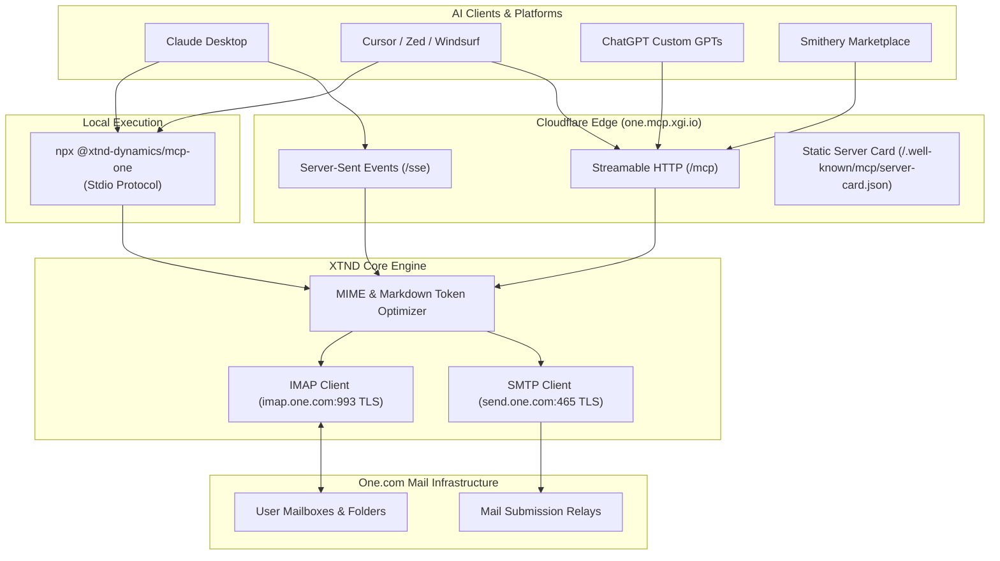

<div align="center">


# 📬 XTND | MCP | ONE
### The Premier Model Context Protocol (MCP) Server for one.com Mail Infrastructure

[](https://www.npmjs.com/package/@xtnd-dynamics/mcp-one)
[](https://opensource.org/licenses/MIT)
[](https://smithery.ai/servers/xtnd/mcp-one)
[](https://modelcontextprotocol.io)
[](https://workers.cloudflare.com)
[](https://www.typescriptlang.org)

<p align="center">
  
</p>

**Empower Claude, Cursor, ChatGPT, Zed, and autonomous AI agents with full mailbox intelligence (IMAP/SMTP) over one.com.**

[Features](#-key-features) • [Client Setup Guides](#-client-setup-guides) • [Tool Catalog](#-tool-catalog-15-tools) • [Workflow Prompts](#-workflow-prompts-4-assistants) • [Dynamic Resources](#-mcp-resources-4-endpoints) • [Architecture](#-architecture) • [Security](#-security--ai-token-budgeting)

</div>

---

## 🚀 Key Features

* **📂 Complete Mailbox Hierarchy**: Manage all standard and custom folders (`INBOX`, `Drafts`, `Sent`, `Archive`, `Trash`) with real-time total and unread message counters.
* **🔍 Server-Side Search Engine**: Search by full-text keyword, sender, recipient, subject, date ranges, and flags (`unread`, `flagged`) without downloading gigabytes of data.
* **📖 AI Context Protection**: Automatically converts HTML emails into clean, token-efficient Markdown, stripping tracking pixels, inline CSS blobs, and scripts.
* **🏷️ Triage & Flagging**: Mark emails as read/unread/flagged, batch move between folders, and perform safe trash or permanent expunge.
* **✉️ Outbound SMTP Delivery**: Send new messages via `send.one.com:465` (implicit TLS), draft intelligent replies with automated `In-Reply-To`/`References`, forward threads, and manage drafts.
* **⚡ Triple-Transport Architecture**: 
  1. **NPX Stdio** for local desktop clients (`npx @xtnd-dynamics/mcp-one`).
  2. **Streamable HTTP (`/mcp`)** for Smithery, Cursor, and web AI agents.
  3. **Server-Sent Events (`/sse`)** for legacy streaming clients.

---

## 📦 Client Setup Guides

### 1. Claude Desktop (Local NPX)

Add the following to your `claude_desktop_config.json`:

* **macOS:** `~/Library/Application Support/Claude/claude_desktop_config.json`
* **Windows:** `%APPDATA%\Claude\claude_desktop_config.json`

```json
{
  "mcpServers": {
    "XTND | MCP | ONE": {
      "command": "npx",
      "args": ["-y", "@xtnd-dynamics/mcp-one"],
      "env": {
        "ONECOM_EMAIL": "user@yourdomain.com",
        "ONECOM_PASSWORD": "your_mailbox_password"
      }
    }
  }
}
```

---

### 2. 1-Click Install via Smithery CLI

```bash
npx -y @smithery/cli install @xtnd-dynamics/mcp-one --client claude
```

---

### 3. Cursor IDE (`.cursor/mcp.json`)

```json
{
  "mcpServers": {
    "one-mail": {
      "command": "npx",
      "args": ["-y", "@xtnd-dynamics/mcp-one"],
      "env": {
        "ONECOM_EMAIL": "user@yourdomain.com",
        "ONECOM_PASSWORD": "your_mailbox_password"
      }
    }
  }
}
```

---

### 4. Zed Editor (`settings.json`)

```json
{
  "context_servers": {
    "one-mail": {
      "command": {
        "path": "npx",
        "args": ["-y", "@xtnd-dynamics/mcp-one"],
        "env": {
          "ONECOM_EMAIL": "user@yourdomain.com",
          "ONECOM_PASSWORD": "your_mailbox_password"
        }
      }
    }
  }
}
```

---

### 5. Remote Hosted Edge Gateway (Streamable HTTP / SSE)

For web-based AI clients or SaaS deployments:

* **Streamable HTTP Endpoint:** `https://one.mcp.xgi.io/mcp`
* **SSE Endpoint:** `https://one.mcp.xgi.io/sse`

```json
{
  "mcpServers": {
    "XTND | MCP | ONE": {
      "url": "https://one.mcp.xgi.io/mcp",
      "headers": {
        "X-OneCom-Email": "user@yourdomain.com",
        "X-OneCom-Password": "your_mailbox_password"
      }
    }
  }
}
```

---

## 🛠️ Tool Catalog (15 Tools)

| Tool Name | Description | Key Arguments |
|---|---|---|
| `list_folders` | List all mailboxes/folders with message and unread counts | *(none)* |
| `create_folder` | Create a new mailbox folder | `name` (string) |
| `rename_folder` | Rename an existing mailbox folder | `oldName`, `newName` |
| `delete_folder` | Delete a mailbox folder | `name` (string) |
| `search_emails` | Server-side filtered email search | `folder`, `query`, `from`, `to`, `subject`, `unreadOnly`, `limit` |
| `get_recent_emails` | Retrieve recent email headers and envelope metadata | `folder`, `limit` |
| `get_email_content` | Fetch full message body converted to Markdown | `folder`, `uid`, `format` |
| `get_email_thread` | Retrieve full conversation thread history | `folder`, `uidOrMessageId` |
| `mark_emails` | Update flags (read, unread, flag, unflag) | `folder`, `uids`, `action` |
| `move_emails` | Move emails between folders (e.g. to Archive) | `sourceFolder`, `targetFolder`, `uids` |
| `delete_emails` | Soft delete to Trash or permanent expunge | `folder`, `uids`, `permanent` |
| `send_email` | Send outbound email via `send.one.com:465` (TLS) | `to`, `subject`, `bodyText`, `bodyHtml` |
| `reply_email` | Reply with automated headers and quotation | `folder`, `uid`, `bodyText`, `replyAll` |
| `forward_email` | Forward email with original header context | `folder`, `uid`, `to`, `comment` |
| `create_draft` | Save message draft directly to one.com Drafts | `to`, `subject`, `bodyText` |

---

## 🧠 Workflow Prompts (4 Assistants)

| Prompt Name | Purpose | Parameters |
|---|---|---|
| `triage-inbox` | Scans unread emails, categorizes into priority buckets, and drafts action plans | `limit` (optional) |
| `draft-reply` | Inspects thread context and drafts contextual replies | `uid` (required), `tone` (optional) |
| `clean-inbox` | Identifies marketing newsletters, promotional blasts, and automated alerts | `folder` (optional) |
| `executive-briefing` | Generates a high-density daily digest with blocker checklist | *(none)* |

---

## 📂 MCP Resources (4 Endpoints)

| Resource URI | MIME Type | Description |
|---|---|---|
| `one://folders` | `application/json` | Real-time catalog of all mailboxes and unread counters |
| `one://status` | `application/json` | Gateway connection health and protocol capabilities |
| `one://templates/meeting-followup` | `text/markdown` | Standardized executive meeting summary template |
| `one://templates/out-of-office` | `text/markdown` | Standardized out-of-office auto-reply template |

---

## 🏛️ Architecture



---

## 🔒 Security & AI Token Budgeting

* **Zero-Credential Storage**: Credentials are never persisted on edge servers. Stdio uses local process environment; hosted gateway uses ephemeral request headers.
* **Implicit TLS Only**: Inbound connections use port 993 (IMAPS) and outbound uses port 465 (SMTPS) over strict TLS sockets, avoiding STARTTLS vulnerabilities.
* **Token Budget Guard**: Incoming HTML is sanitized and converted to semantic Markdown, discarding CSS boilerplate, tracking pixels, and binary attachments to prevent context window exhaustion.

---

## 📄 License

MIT License © 2026 [XTND Dynamics](https://github.com/XTND-DYNAMICS). Developed for the global AI developer ecosystem.
